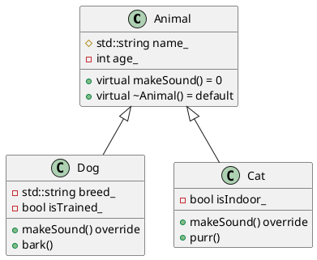

# C++ UML Class Diagram Generator

A powerful Model Context Protocol (MCP) server that recursively analyzes C++ source and header files, extracts class definitions, inheritance relationships, and member information, then generates comprehensive UML class diagrams in PlantUML format.

## Features
- 🔍 **Multi-format C++ file support**: .cpp, .hpp, .h, .cc, .cxx files
- 🏗️ **Class & struct extraction**: Automatically detects class/struct definitions
- 🔗 **Inheritance mapping**: Captures inheritance relationships and generates proper UML arrows
- 👁️ **Member visibility**: Handles public, private, and protected member access levels
- 📁 **Directory scanning**: Recursively processes entire project folders
- 📄 **Content-based processing**: Generate UML from provided file contents directly
- 🛡️ **Error handling**: Robust error handling with diagnostic UML output
- 🌐 **MCP server support**: Works as both HTTP and stdio MCP server
- 🐳 **Docker ready**: Containerized deployment support
- ✨ **PlantUML output**: Clean, valid PlantUML format for easy rendering

## Installation

### Quick Start
```bash
# Clone the repository
git clone https://github.com/hydavinci/uml-diagram.git
cd uml-diagram

# Install dependencies
pip install -r requirements.txt
# or using uv
uv sync
```

### Docker Deployment
```bash
# Build the container
docker build -t uml-diagram-mcp .

# Run as HTTP server
docker run -p 8081:8081 -e TRANSPORT=http uml-diagram-mcp

# Run as stdio server
docker run -e TRANSPORT=stdio uml-diagram-mcp
```

## Usage

### As a Standalone Script
```bash
# Navigate to the src directory
cd src

# Generate UML from a C++ project directory
python uml_generate.py /path/to/your/cpp/project

# The UML diagram will be written to 'uml_output.puml' in the current directory
```

**Example:**
```bash
python uml_generate.py "C:\Projects\MyProject\src"
# Output: uml_output.puml
```

### As a Python Module

#### Directory-based Generation
```python
from src.uml_generate import generate_cpp_uml_from_path

# Generate UML from a directory
uml_diagram = generate_cpp_uml_from_path('/path/to/cpp/project')
print(uml_diagram)

# Save to file
with open('my_diagram.puml', 'w') as f:
    f.write(uml_diagram)
```

#### Content-based Generation
```python
from src.uml_generate import generate_cpp_uml_from_content

# Dictionary where keys are file names and values are file contents
file_contents = {
    "animal.h": """
    class Animal {
    public:
        virtual void makeSound() = 0;
        virtual ~Animal() = default;
    protected:
        std::string name_;
    private:
        int age_;
    };
    """,
    "dog.h": """
    #include "animal.h"
    
    class Dog : public Animal {
    public:
        void makeSound() override;
        void bark();
    private:
        std::string breed_;
        bool isTrained_;
    };
    """,
    "cat.h": """
    #include "animal.h"
    
    class Cat : public Animal {
    public:
        void makeSound() override;
        void purr();
    private:
        bool isIndoor_;
    };
    """
}

uml_diagram = generate_cpp_uml_from_content(file_contents)
print(uml_diagram)
```

### As an MCP Server

This tool provides a complete Model Context Protocol (MCP) server implementation with two available tools:

#### Available MCP Tools

1. **`generate_cpp_uml`** - Directory-based UML generation
   - **Parameter**: `path` (string) - Path to directory containing C++ files
   - **Returns**: PlantUML diagram as string
   - **Example**: Analyze entire C++ project directory

2. **`generate_cpp_uml_from_content`** - Content-based UML generation  
   - **Parameter**: `file_contents` (Dict[str, str]) - Dictionary mapping file names to their contents
   - **Returns**: PlantUML diagram as string
   - **Example**: Generate UML from provided source code snippets

#### Starting the MCP Server

**HTTP Mode** (recommended for web clients):
```bash
# Set transport mode and start server
export TRANSPORT=http
python src/server.py

# Server will start on port 8081 by default
# Access at: http://localhost:8081
```

**Stdio Mode** (for command-line clients):
```bash
# Default mode - no environment variable needed
python src/server.py

# Or explicitly set stdio mode
export TRANSPORT=stdio
python src/server.py
```

#### MCP Client Integration Example

```python
import asyncio
from mcp import ClientSession, StdioServerParameters
from mcp.client.stdio import stdio_client

async def use_uml_generator():
    server_params = StdioServerParameters(
        command="python",
        args=["src/server.py"],
        cwd="/path/to/uml-diagram"
    )
    
    async with stdio_client(server_params) as (read, write):
        async with ClientSession(read, write) as session:
            # Initialize the session
            await session.initialize()
            
            # Generate UML from directory
            result = await session.call_tool(
                "generate_cpp_uml",
                {"path": "/path/to/cpp/project"}
            )
            
            print("Generated UML:")
            print(result.content[0].text)

# Run the example
asyncio.run(use_uml_generator())
```

## Requirements

### System Requirements
- **Python**: 3.10 or higher
- **Operating System**: Windows, Linux, macOS
- **Memory**: Minimum 512MB RAM (more for large codebases)

### Dependencies

#### Core Dependencies (included in pyproject.toml)
- `fastmcp>=0.2.0` - For MCP server functionality

#### Python Standard Library (no installation needed)
- `os` - File system operations
- `re` - Regular expression parsing
- `typing` - Type hints
- `json` - JSON handling (middleware)
- `base64` - Encoding (middleware)
- `urllib.parse` - URL parsing (middleware)

#### Development Dependencies (optional)
```bash
# For development and testing
pip install pytest black flake8
```

### PlantUML Rendering (optional)
To view the generated `.puml` files:
- **VS Code**: Install PlantUML extension
- **Online**: Use [PlantUML Online Server](http://www.plantuml.com/plantuml/uml/)
- **Local**: Install PlantUML with Java runtime

## Output Examples

### Generated PlantUML Structure
The tool generates clean, well-formatted PlantUML diagrams:



### Symbol Meanings
- `+` Public members
- `-` Private members  
- `#` Protected members
- `<|--` Inheritance relationship (base <|-- derived)

### File Output
- **Script mode**: Creates `uml_output.puml` in current directory
- **Module mode**: Returns PlantUML string for programmatic use
- **MCP mode**: Returns PlantUML string via MCP protocol

## Project Structure

```
uml-diagram/
├── src/
│   ├── server.py           # MCP server implementation
│   ├── uml_generate.py     # Core UML generation logic
│   └── middleware.py       # HTTP request middleware
├── Dockerfile              # Container configuration
├── pyproject.toml          # Project dependencies and metadata
├── smithery.yaml           # Smithery platform configuration
├── README.md               # This file
└── LICENSE                 # MIT license
```

## Supported C++ Features

### Class Detection
- ✅ Class definitions
- ✅ Struct definitions  
- ✅ Template classes (generics stripped for PlantUML compatibility)
- ✅ Nested classes (basic support)

### Inheritance
- ✅ Single inheritance
- ✅ Multiple inheritance
- ✅ Public inheritance
- ✅ Protected inheritance
- ✅ Private inheritance

### Member Detection
- ✅ Public, private, protected members
- ✅ Methods and functions
- ✅ Variables and fields
- ✅ Virtual and pure virtual methods
- ✅ Constructors and destructors
- ✅ Static members (basic support)

### Limitations
- ⚠️ Complex template specializations may not be fully captured
- ⚠️ Preprocessor macros are not expanded
- ⚠️ Forward declarations without definitions are skipped
- ⚠️ Some complex C++ syntax may require manual review

## Configuration

### Environment Variables
- `TRANSPORT`: Set to "http" for HTTP mode, "stdio" for stdio mode (default)
- `PORT`: HTTP server port (default: 8081)
- `SERVER_TOKEN`: Optional authentication token for stdio mode

### Smithery Platform
This project includes `smithery.yaml` for deployment on the Smithery platform:
- Containerized runtime
- HTTP transport mode
- Auto-scaling support

## Troubleshooting

### Common Issues

**"No C++ classes found" message:**
- Verify the path contains .cpp, .hpp, .h, .cc, or .cxx files
- Check file encoding (UTF-8 recommended)
- Ensure class definitions use standard C++ syntax

**Empty or malformed UML output:**
- Review C++ syntax for unsupported constructs
- Check for balanced braces in class definitions
- Verify inheritance syntax follows standard format

**MCP server connection issues:**
- Ensure correct transport mode (http vs stdio)
- Check port availability (8081 by default)
- Verify dependencies are installed (`fastmcp`)

### Debug Mode
Enable verbose logging by modifying `server.py`:
```python
# Add debug logging
import logging
logging.basicConfig(level=logging.DEBUG)
```

## Contributing

1. Fork the repository
2. Create a feature branch: `git checkout -b feature-name`
3. Make your changes and add tests
4. Commit: `git commit -am 'Add feature-name'`
5. Push: `git push origin feature-name`
6. Create a Pull Request

### Development Setup
```bash
# Clone and setup development environment
git clone https://github.com/hydavinci/uml-diagram.git
cd uml-diagram

# Install in development mode
pip install -e .

# Run tests (if available)
python -m pytest

# Format code
black src/
```

## License

This project is licensed under the MIT License - see the [LICENSE](LICENSE) file for details.

## Changelog

### v0.1.0
- Initial release
- Directory-based UML generation
- Content-based UML generation  
- MCP server with HTTP and stdio transport
- Docker containerization support
- PlantUML output format
- Class, inheritance, and member detection

---

**Author**: [hydavinci](https://github.com/hydavinci)  
**Repository**: [https://github.com/hydavinci/uml-diagram](https://github.com/hydavinci/uml-diagram)